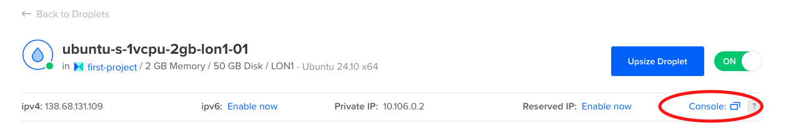

# RemoteDesktop
In this guide I'll show how setup a desktop on a VPS and use it a PC. More importantly launch a browser like chrome.

# Buy a VPS

I personally use DigitalOcean, because I am familiar with it. If you don't have a DigitalOcean account you can setup through my [referral link](https://m.do.co/c/f2b07e170125) and get $200 at the time of this writing. It also gives me $25.

After you create your VPS (aka Droplet), connect to your machine through ssh or simply click the console button in your dashboard.



At the moment you only have the terminal access, there is no GUI.

# Install GUI for the server
Follow this [guide to install a lightweight desktop environment](https://www.digitalocean.com/community/tutorials/how-to-install-and-configure-vnc-on-ubuntu-20-04).

# Connect to the GUI from your local machine
In the guide above all platforms are not covered, check [TightVNC official website](https://www.tightvnc.com/download.php) to see what's the best option for you. For example, I am on mac and Remote Ripple works fine.

# Set your GUI as the DISPLAY of the OS
One issue that I had was I couldn't get Chrome running. I was getting an error that there is an issue with Display or X. When you install the GUI you get the DISPLAY number as the output. Like this:
```
Output
New 'X' desktop is your_hostname:1
```

As you see the display is :1. To set the DISPLAY variable to this:
```
export DISPLAY=:1 (or whatever number you get above)
```

If you're loggin in as the root, you need to bypass access control entirely, run the following command in your VNC session (not recommended for permanent setups):
```
xhost +
```

For me the final stage was a bit challenging, hope it helps. If you had any comments or issues, do not hesitate to reach out.

All the best,
Mohammad